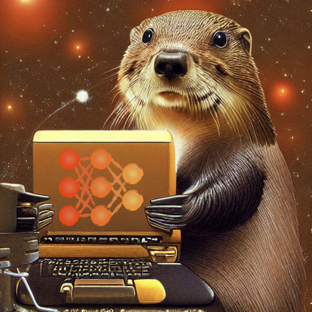

# Курс "Глубинное обучение (ГО) 1 / Введение в ГО" на ФКН ВШЭ

  

## Версии курса прошлых лет

* [2021-2022](https://github.com/isadrtdinov/intro-to-dl-hse/tree/2021-2022)

## Полезные ссылки

* [Вики-страничка](http://wiki.cs.hse.ru/Глубинное_обучение_1_22/23)
* [Таблица с оценками](https://docs.google.com/spreadsheets/d/1GUChnaG3M9zVVY-p8qtgsYrLas43w__BxrnyobNGctw/edit?usp=sharing)
* [Плейлист с записями занятий](https://www.youtube.com/playlist?list=PLEwK9wdS5g0onnKgvKxuUJN1Ojchl9Q9P)

## Лекции

1. Автоматическое дифференцирование, полносвязные нейронные сети: [запись](https://www.youtube.com/watch?v=g552oCpg-NE&list=PLEwK9wdS5g0onnKgvKxuUJN1Ojchl9Q9P&index=1&t=1756s&ab_channel=ФКНВШЭ—дистанционныезанятия)
2. Оптимизация нейронных сетей, SGD, Adam/AdamW. Dropout и Batch-нормализация: [запись](https://www.youtube.com/watch?v=O9JV_Kgd31E&list=PLEwK9wdS5g0onnKgvKxuUJN1Ojchl9Q9P&index=3&t=1939s&ab_channel=ФКНВШЭ—дистанционныезанятия)
3. Разбор дифференцирования из МДЗ 1, операция свертки: [запись](https://youtu.be/xa69n0yCid8)
4. Архитектуры сверточных нейронных сетей: [запись](https://youtu.be/5S5HpbDm7eA)
5. Задачи компьютерного зрения, сегментация и детекция: [запись](https://youtu.be/gJfDJoLEZIY)
6. Токенизация текстов, эмбеддинги слов, TextCNN: [запись](https://youtu.be/WihC2R5lNmg)
7. Рекуррентные нейронные сети, языковые модели: [запись](https://youtu.be/Ysj4i2S0D6c)
8. Архитектура трансформера: [запись](https://youtu.be/wLUJVRqzEyM)
9. Self-supervised learning, BERT, SimCLR: [запись](https://youtu.be/VpfqcP8HRmQ)
10. Трансформеры для компьютерного зрения: [запись](https://youtu.be/Dd7uQiAzrnA)
11. Оценка неопределенности, дистилляция, прунинг, квантизация: [запись](https://youtu.be/Jc-wbLCHtns)
12. Соревновательные атаки, генеративно-состязательные сети (GAN): [запись](https://youtu.be/banZhpreS2Y)
13. Автокодировщик, вариационный автокодировщик: [запись](https://youtu.be/sscXFM9jcHA)

## Семинары

1. Введение в библиотеку PyTorch. Автоматическое дифференцирование: [запись (группа 202)](https://www.youtube.com/watch?v=j6JxUpGaav4&list=PLEwK9wdS5g0onnKgvKxuUJN1Ojchl9Q9P&index=2&t=3s&ab_channel=ФКНВШЭ—дистанционныезанятия)
2. Полносвязные нейронные сети. Общая схема пайплайна обучения на PyTorch: [запись (группа 202)](https://www.youtube.com/watch?v=LZQVBuzttjM&list=PLEwK9wdS5g0onnKgvKxuUJN1Ojchl9Q9P&index=4&t=1799s&ab_channel=ФКНВШЭ—дистанционныезанятия)
3. Свертки в PyTorch, реализация архитектуры LeNet: [запись (группа 202)](https://youtu.be/C.CCiGacZAVo)
4. Обучение моделей из torchvision, аугментации и fine-tuning: [запись (группа 202)](https://youtu.be/1wCd23p2l98)
5. Семантическая сегментация и детекция: [запись (группа 202)](https://youtu.be/NSNYSEYAHa8)
6. Word2Vec, Fasttext и TextCNN: [запись (группа 202)](https://youtu.be/2r67B1sPlDU)
7. Генерация последовательностей, image captioning: [запись (группа 202)](https://youtu.be/-KdvXtUhwEk)
8. Архитектура трансформера: [запись (группа 202)](https://youtu.be/QY456sQVTrM)
9. Дообучение модели BERT: [запись (группа 202)](https://youtu.be/XeFc3-_AYl8)
10. Семинар не проводился
11. Дистилляция, прунинг, квантизация: [запись (группа 202)](https://youtu.be/vbvsqvcipO8)
12. Соревновательные атаки, генеративно-состязательные сети (GAN): [запись (группа 202)](https://youtu.be/KgVkxjxf_T0)
13. Автокодировщик, вариационный автокодировщик: [запись (группа 202)](https://youtu.be/BCvYmiIsNqQ)

## Маленькие домашние задания

1. Автоматическое дифференцирование и полносвязные нейронные сети: [ссылка](https://github.com/isadrtdinov/intro-to-dl-hse/tree/2022-2023/homeworks-small/shw-01-mlp)
2. Сверточный классификатор: [ссылка](https://github.com/isadrtdinov/intro-to-dl-hse/blob/2022-2023/homeworks-small/shw-02-cnn.ipynb)
3. RNN и языковые модели: [ссылка](https://github.com/isadrtdinov/intro-to-dl-hse/blob/2022-2023/homeworks-small/shw-03-rnn/shw-03-rnn.ipynb)

## Теоретические домашние задания

Теоретические ДЗ не сдаются и предлагаются студентам для самостоятельного решения и ознакомления

1. Полносвязные нейронные сети: [ссылка](https://github.com/isadrtdinov/intro-to-dl-hse/blob/2022-2023/homeworks-theory/thw-01-mlp.pdf)
2. Сверточные нейронные сети: [ссылка](https://github.com/isadrtdinov/intro-to-dl-hse/blob/2022-2023/homeworks-theory/thw-02-cnn.pdf)
